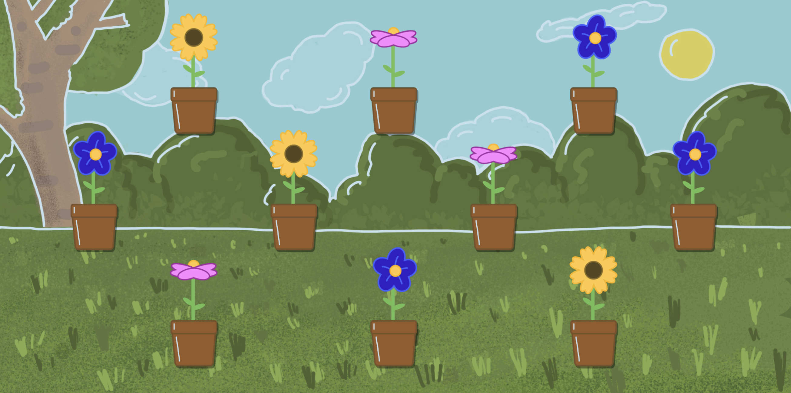

# Plant Game

Interactive plant watering game built with p5.js. Water plants by hovering over them to watch them grow and bloom.

## How to Play

Open `index.html` in a web browser. Move your mouse to control the watering can and hover over pots to water the 9 plants. Each plant takes 5 seconds to fully grow into sunflowers, pink flowers, or blue flowers.

## Technologies

p5.js, HTML5 Canvas, SVG graphics
